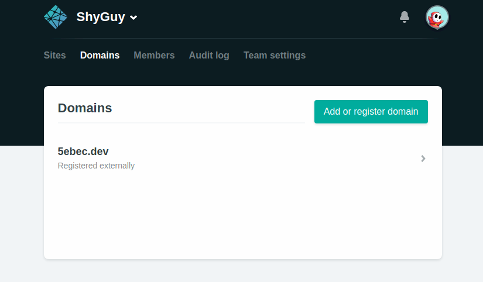
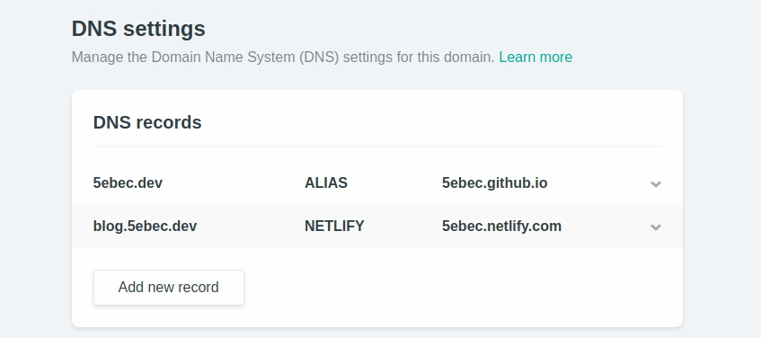

[これ](/posts/2019/06/09/netlify-custom-domain/)の続き。

前回、カスタムネームサーバーを使用してDNSをNetlifyに移したのでGoogle DomainsのDNSからはカスタムリソースレコードの設定はできない。

NetlifyのDomainsタブを開く。



DNS settingsのAdd new recordを以下のように設定する。

```
Record type: ALIAS
Name: @
Value: *USERNAME*.github.io
```



GitHub PagesのレポジトリのページからSetting > Options > GitHub Pages > Custom domainにカスタムドメインを書いてSave。

完成。
